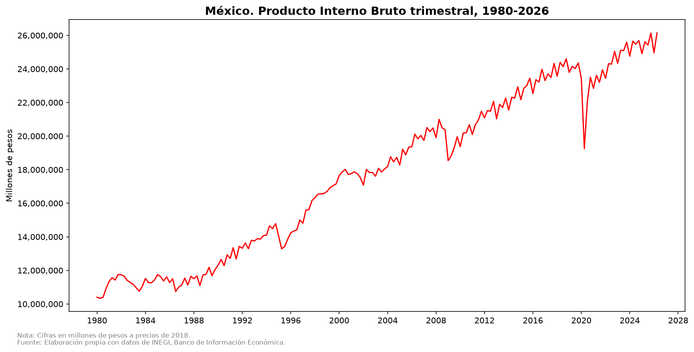
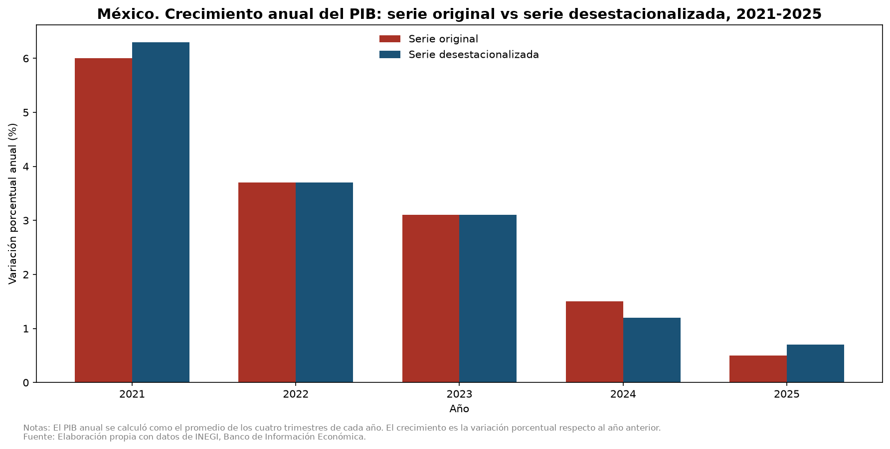

# Análisis descriptivo del crecimiento del Producto Interno Bruto mexicano

Este proyecto describe cómo ha crecido la economía mexicana entre el 1T-1980 y el 2T-2026, a partir del PIB trimestral a precios constantes de 2018 que publica INEGI, y qué cambia al leerlo con la serie original o con la desestacionalizada. Es un análisis descriptivo: calcula tasas de crecimiento y las muestra en gráficas. No estima modelos, no pronostica y no establece causas.

## Contenido

- [Preguntas que responde](#preguntas-que-responde)
- [Resultados principales](#resultados-principales)
- [Alcance](#alcance)
- [Fuente de los datos](#fuente-de-los-datos)
- [Metodología](#metodología)
- [Estructura del proyecto](#estructura-del-proyecto)
- [Tecnologías](#tecnologías)
- [Cómo ejecutar el proyecto](#cómo-ejecutar-el-proyecto)
- [Proceso y aprendizajes](#proceso-y-aprendizajes)
- [Limitaciones](#limitaciones)
- [Mejoras futuras](#mejoras-futuras)
- [Referencias](#referencias)
- [Autoría y licencia](#autoría-y-licencia)

## Preguntas que responde

## Preguntas que responde

**Serie original**

1. ¿Cómo ha evolucionado el PIB?
2. ¿Cuánto ha crecido el PIB en el último trimestre registrado (2T-2026 contra 2T-2025)?
3. ¿Cómo ha sido el crecimiento del PIB en los últimos cinco años (2021-2025)?

**Serie desestacionalizada**

4. ¿Cómo se compara la serie original con la serie desestacionalizada?
5. ¿Cómo se comparan los crecimientos anuales de ambas series?
6. ¿Cuánto ha crecido el PIB en el último trimestre respecto al trimestre anterior (2T-2026 contra 1T-2026)?
7. ¿Cómo ha sido el crecimiento del PIB en los últimos 10 trimestres (1T-2024 a 2T-2026)?

## Resultados principales

- El PIB muestra una tendencia creciente de largo plazo, con seis contracciones identificadas a simple vista, cada una delimitada del pico al valle. Cinco se observan en la serie original; la sexta, de 1985 a 1986, también se aprecia en la serie original, pero es más fácil de delimitar en la serie desestacionalizada. En 2022 el PIB regresa a niveles similares a los prepandemia.



| Contracción | Serie original | Serie desestacionalizada |
|---|:---:|:---:|
| Crisis de la deuda externa | 4T-1981 a 3T-1983 | 2T-1982 a 2T-1983 |
| "Efecto Tequila" | 4T-1994 a 2T-1995 | 4T-1994 a 2T-1995 |
| Crisis "dot com" | 2T-2001 a 1T-2002 | 1T-2001 a 1T-2002 |
| Crisis financiera global | 2T-2008 a 1T-2009 | 3T-2008 a 2T-2009 |
| Caída previa y pandemia de COVID-19 | 4T-2019 a 2T-2020 | 3T-2019 a 2T-2020 |
| Contracción de 1985-1986 | Descenso visible, difícil de delimitar | 3T-1985 a 4T-1986 |

Los periodos se delimitan a simple vista, del pico al valle, sin una definición formal de recesión. Los nombres de cada episodio son el contexto histórico que mencionan las notas periodísticas consultadas (Expansión, 2023; Sandoval, 2024; Casillas, 2022); este análisis describe cuándo cae el PIB, no por qué.

- En el 2T-2026, el PIB crece 2.1% respecto al 2T-2025 (serie original).
- El crecimiento anual se desacelera de 2021 a 2025: un fuerte repunte en 2021, que refleja en parte la base baja de 2020, un crecimiento moderado en 2022 y 2023, y un crecimiento bajo en 2024 y 2025.
- En el 2T-2026, el PIB desestacionalizado crece 1.4% respecto al 1T-2026, el mayor avance de los últimos 10 trimestres (datos preliminares).
- Los últimos 10 trimestres alternan entre alzas y bajas pequeñas. La excepción es el 2T y el 3T de 2025, con variaciones de 0.0% y -0.1%.

Crecimiento anual del PIB (%), 2021-2025 (el cálculo parte de 2020):

| Año | Serie original | Serie desestacionalizada | Diferencia (p.p.) |
|-----|:--------------:|:------------------------:|:-----------------:|
| 2021 | 6.0 | 6.3 | 0.3 |
| 2022 | 3.7 | 3.7 | 0.0 |
| 2023 | 3.1 | 3.1 | 0.0 |
| 2024 | 1.5 | 1.2 | -0.3 |
| 2025 | 0.5 | 0.7 | 0.2 |



Las dos series arrojan crecimientos anuales similares, como se espera: al promediar los cuatro trimestres de cada año, el efecto estacional tiende a cancelarse. Las diferencias de hasta 0.3 p.p. pueden deberse a los efectos de calendario y a las revisiones de INEGI; este análisis no permite separar una causa de la otra.

> Nota: INEGI publica para el 2T-2026 una variación anual de 1.9% con la serie desestacionalizada. Este proyecto calcula la variación interanual solo con la serie original (2.1%). Son series distintas, por lo que las cifras no son directamente comparables.

## Alcance

**Incluye**

- PIB trimestral a precios de 2018, series original y desestacionalizada.
- Periodo: 1T-1980 a 2T-2026 (últimos datos publicados por INEGI a la fecha de consulta).
- Cálculo de tasas de crecimiento (interanual, anual y trimestral) y visualización.

**No incluye**

- Análisis econométrico ni pronósticos.
- Análisis causal de las crisis. El notebook menciona las causas históricas solo como contexto, no como resultado del análisis.
- Comparaciones internacionales.

## Fuente de los datos

Ambas series provienen de INEGI, Banco de Información Económica (BIE), indicadores económicos de coyuntura: <https://www.inegi.org.mx/app/indicadores/?tm=3>

Los dos archivos tienen dos columnas: `Periodos` (formato `AAAA/TT`, por ejemplo `2026/02`) y `PIB`.

| | Serie original | Serie desestacionalizada |
|---|---|---|
| **Archivo** | `data/pib-precios-2018.csv` | `data/pib-precios-2018-desestacionalizada.csv` |
| **Periodicidad** | Trimestral | Trimestral |
| **Periodo** | 1T-1980 a 2T-2026 | 1T-1980 a 2T-2026 |
| **Unidad** | Millones de pesos a precios de 2018 | Millones de pesos a precios de 2018 |
| **Fecha de consulta** | 19 de septiembre de 2026 | 19 de septiembre de 2026 |

**Ruta de descarga: serie original**

Indicadores económicos de coyuntura > Producto interno bruto trimestral, base 2018 > Series originales > Valores a precios de 2018 > Producto Interno Bruto (Millones de pesos a precios de 2018) Trimestral.

**Ruta de descarga: serie desestacionalizada**

Indicadores económicos de coyuntura > Producto interno bruto trimestral, base 2018 > Series desestacionalizadas y tendencia-ciclo > A precios de 2018 > Total > Serie desestacionalizada > Valores absolutos (Millones de pesos a precios de 2018) Trimestral.

**Notas de INEGI sobre los datos**

- Serie original: los trimestres de 2026 son datos revisados (r1).
- Serie desestacionalizada: del 1T-1993 al 2T-2026, los datos son preliminares. INEGI calcula esta serie por métodos econométricos a partir de las series originales del PIB trimestral.
- INEGI revisa sus cifras con frecuencia. Si descargas los datos en otra fecha, los resultados pueden cambiar ligeramente.

## Metodología

- **Crecimiento interanual.** Compara el mismo trimestre de años consecutivos (2T-2026 contra 2T-2025). Evita el efecto de la estacionalidad en la serie original.
- **PIB anual y su crecimiento.** El PIB anual es el promedio simple de los cuatro trimestres del año (Heath, 2012, cap. 4, apartado 4.8, p. 72). El crecimiento anual es la variación porcentual entre promedios anuales consecutivos. El año 2020 sirve de base, por lo que las tasas corresponden a 2021-2025.
- **Crecimiento trimestral.** Compara cada trimestre con el inmediato anterior (t contra t-1). Este cálculo solo es válido con la serie desestacionalizada. El notebook calcula la variación sobre toda la serie y filtra después, para que el 1T-2024 tenga como base el 4T-2023.
- **Redondeo.** Las tasas se redondean a un decimal. En el 2T-2025, la variación trimestral es -0.02% y se redondea a 0.0, valor que coincide con el publicado por INEGI.
- **Desestacionalización.** INEGI usa el paquete X-13ARIMA-SEATS y ajusta dos efectos de calendario: la frecuencia de los días de la semana y la Semana Santa (INEGI, 2018, apartado 2.2.2).
- **Identificación de contracciones.** El análisis identifica las contracciones a simple vista en la gráfica, con dos criterios: caídas que se encadenan durante varios trimestres seguidos (más de tres) y caídas muy marcadas, aunque duren menos, como las de 1994 y 2020. No usa una definición formal de recesión.

## Estructura del proyecto

```
pib_mexico/
├── data/
│   ├── pib-precios-2018.csv
│   └── pib-precios-2018-desestacionalizada.csv
├── figures/
│   ├── grafica_01_evolucion_pib.png
│   ├── grafica_02_crecimiento_pib_anual.png
│   ├── grafica_03_comparacion_series.png
│   ├── grafica_04_comparacion_crecimiento_anual_series.png
│   └── grafica_05_crecimiento_trimestral_desestacionalizado.png
├── notebooks/
│   └── analisis_pib.ipynb
├── .gitignore
├── LICENSE
├── README.md
└── requirements.txt
```

## Tecnologías

| Herramienta | Versión |
|---|---|
| Python | 3.14.2 |
| pandas | 3.0.6 |
| numpy | 2.5.3 |
| matplotlib | 3.11.2 |
| ipykernel | Última disponible |

El análisis se desarrolla en un Jupyter Notebook, que se ejecuta desde Visual Studio Code con la extensión de Jupyter.

## Cómo ejecutar el proyecto

1. Clona el repositorio y entra a la carpeta:

   ```bash
   git clone https://github.com/Jose-Castanedas/pib_mexico.git
   cd pib_mexico
   ```

2. Crea y activa un entorno virtual:

   ```bash
   python -m venv .venv
   source .venv/bin/activate      # En Windows: .venv\Scripts\activate
   ```

3. Instala las dependencias:

   ```bash
   pip install -r requirements.txt
   ```

4. Abre `notebooks/analisis_pib.ipynb` en Visual Studio Code, selecciona el kernel del entorno `.venv` y ejecuta todas las celdas.

El notebook lee los datos con rutas relativas (`../data/`) y guarda las gráficas en `../figures/`, por lo que debe ejecutarse desde la carpeta `notebooks/`. Visual Studio Code lo hace así por defecto. El proyecto se desarrolló con Python 3.14.2 y no se probó con otras versiones.

## Proceso y aprendizajes

El análisis sigue seis pasos: descargar las dos series del BIE, cargarlas y revisarlas, responder las tres preguntas de la serie original, responder las cuatro de la serie desestacionalizada, comparar los resultados entre series y redactar las conclusiones.

Algunas decisiones y aprendizajes del proceso:

- La serie original no permite comparar un trimestre con el anterior, porque la estacionalidad distorsiona el cambio. Por eso la variación trimestral usa solo la serie desestacionalizada.
- Anualizar la serie desestacionalizada con el mismo método que la original sirve como validación cruzada de los cálculos.
- Calcular la variación sobre toda la serie y filtrar después evita perder el primer valor del periodo analizado.
- Contrastar los resultados con las cifras publicadas por INEGI ayuda a detectar problemas de redondeo, como el del 2T-2025.

## Limitaciones

- La identificación de contracciones es visual y no sigue una definición formal.
- Los datos desestacionalizados de 1993 a 2026 son preliminares y INEGI puede revisarlos.
- Las explicaciones de las crisis son contexto histórico, no hallazgos del análisis.

## Mejoras futuras

- Refactorizar el código para eliminar la repetición en las funciones de cálculo y en la creación de gráficas.
- Calcular el crecimiento promedio del PIB por décadas, para complementar la lectura de largo plazo.
- Analizar el significado económico del estancamiento de 2024-2025.
- Definir un criterio formal para identificar las contracciones.

## Referencias

- Casillas, G. (2022, 23 de agosto). *Crisis cambiaria en México 1985-1986* [Columna de opinión]. El Financiero. https://www.elfinanciero.com.mx/opinion/gabriel-casillas/2022/08/23/crisis-cambiaria-en-mexico-1985-1986/
- Expansión. (2023, 30 de septiembre). *Estas son las peores crisis económicas de México*. Expansión. https://expansion.mx/mercados/2023/09/30/peores-crisis-economicas-de-mexico
- Heath, J. (2012). *Lo que indican los indicadores: cómo utilizar la información estadística para entender la realidad económica de México*. Instituto Nacional de Estadística y Geografía (INEGI).
- Instituto Nacional de Estadística y Geografía. (2018). *Metodología del ajuste estacional 2017*. INEGI.
- Instituto Nacional de Estadística y Geografía. (s. f.). *Banco de Información Económica (BIE): indicadores económicos de coyuntura* [Base de datos]. <https://www.inegi.org.mx/app/indicadores/?tm=3>
- Sandoval, A. (2024, 13 de noviembre). *Historia de las recesiones y crisis económicas en México: de 1981 a 2020*. Alto Nivel. https://www.altonivel.com.mx/historia-de-las-recesiones-y-crisis-economicas-en-mexico-de-1981-a-2020/

## Autoría y licencia

Autor: Jose Guadalupe Castañeda Soto

El código de este proyecto se publica bajo la licencia MIT (ver el archivo `LICENSE`). Los datos pertenecen a INEGI y se rigen por sus propios términos de uso.